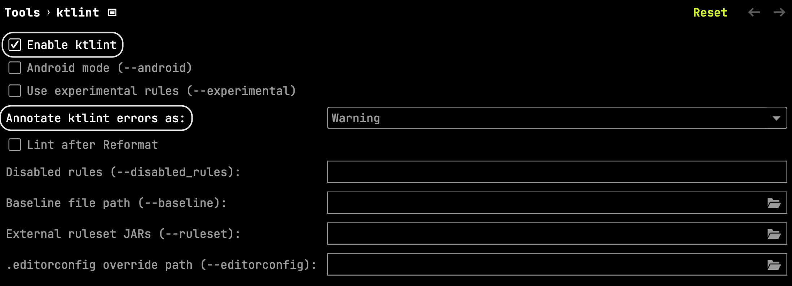
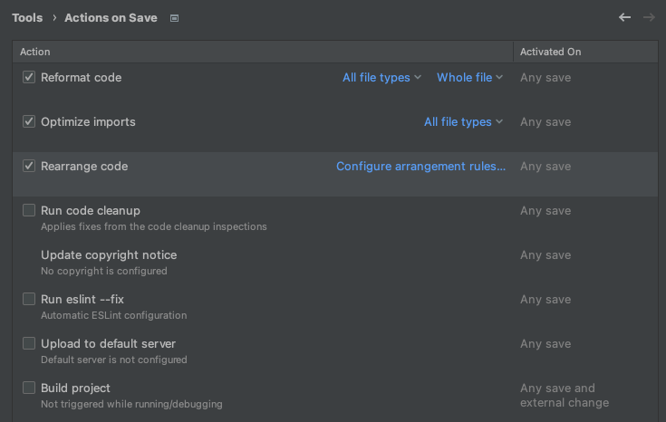

# 개발 가이드

## Lint

### setting

> pre-commit 과 pre-push hook 이 동작하기 위해 사전에 `yarn` 으로 husky 를 설치해야 한다.

```shell
yarn
```

### check

```shell
./gradlew ktlintCheck
```

### format

```shell
./gradlew ktlintFormat
```

### IntelliJ IDEA 설정

파일 저장 시 자동 포맷팅 하려면 `ktlint` 플러그인 설치 후 아래처럼 설정

- Preferences -> Tools -> ktlint Settings



- Preferences -> Tools -> Actions on Save



## Database

### 로컬 DB 실행

요구사항: docker, docker-compose

```shell
docker-compose up
```

### 로깅 설정

테스트 코드 실행 시 발생한 sql 을 보고싶은 경우

- app/src/test/resources/application.yml

```yaml
spring:
  jpa:
    properties:
      hibernate:
        check_nullability: true
        use_sql_comments: true
        format_sql: true
        show_sql: true # true 로 변경

logging:
  level:
    org:
      hibernate:
        type: trace # trace 로 변경
```

### 서버 실행

```shell
./gradlew :app:bootRun
```

### 주의 사항

#### schema.graphql 업데이트

> git hook 이 제대로 설정된 상태라면 푸시하기 전에 테스트가 자동으로 실행된다.

graphql api 변경 시 [schema.graphql](app/src/main/resources/graphql/schema.graphql) 파일도 업데이트 해야한다.
[AppApplicationTests](app/src/test/kotlin/com/santaclose/app/AppApplicationTests.kt) 테스트를 실행하면 된다.

#### category 정보 업데이트

> git hook 이 제대로 설정된 상태라면 푸시하기 전에 테스트가 자동으로 실행된다.

[CategoryAppList.kt](app/src/main/kotlin/com/santaclose/app/category/resolver/dto/CategoryAppList.kt) 파일이 수정된 경우
category 응답 데이터를 업데이트 해야한다.
[CategoryAppQueryResolverTest](app/src/test/kotlin/com/santaclose/app/category/resolver/CategoryAppQueryResolverTest.kt)
테스트를 실행하면 된다.

### 개발 환경 이슈

#### 테스트 실행 또는 서버 실행시, `unresolved reference: lib` 에러 발생

`./gradlew clean` 으로 다시 설치한다. 
